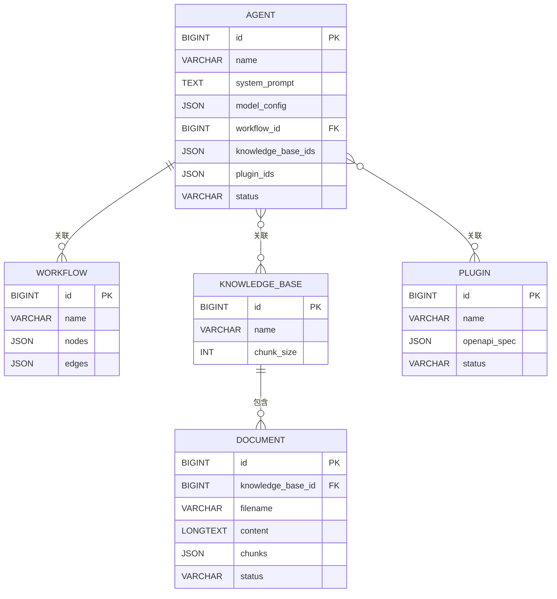

# 数据库设计文档

> **项目名称**: 智能体创作平台  
> **版本**: v1.0  
> **编写日期**: 2025-11-19  
> **编写目的**: 根据用户故事设计数据库表结构，指导后端开发

---

## 目录
1. [设计原则](#1-设计原则)
2. [ER图（实体关系图）](#2-er图实体关系图)
3. [数据库表设计](#3-数据库表设计)
4. [表关系说明](#4-表关系说明)
5. [索引设计](#5-索引设计)
6. [SQL建表脚本](#6-sql建表脚本)

---

## 1. 设计原则

### 1.1 数据库选型
- **关系型数据库**: MySQL 8.0+
- **字符集**: utf8mb4（支持emoji和特殊字符）
- **排序规则**: utf8mb4_unicode_ci

### 1.2 设计规范
1. **表名**: 小写字母，单词间用下划线分隔（如`knowledge_base`）
2. **字段名**: 小写字母，单词间用下划线分隔（如`created_at`）
3. **主键**: 统一使用`id`字段，类型为`BIGINT AUTO_INCREMENT`
4. **时间戳**: 统一使用`DATETIME`类型，包含`created_at`和`updated_at`
5. **JSON字段**: 使用MySQL的JSON类型存储复杂结构（如配置、列表）
6. **外键**: 本项目不使用物理外键，使用逻辑外键（通过应用层保证数据一致性）

### 1.3 数据类型约定
- `id`: BIGINT（支持大数据量）
- 短文本: VARCHAR(100/255/500)
- 长文本: TEXT / LONGTEXT
- 枚举状态: VARCHAR(20)（如draft/published）
- JSON数据: JSON类型
- 时间: DATETIME

---

## 2. ER图（实体关系图）

```
┌─────────────┐         ┌──────────────┐
│   Agent     │◆────────│  Workflow    │
│  (智能体)    │ 0..1    │  (工作流)     │
└─────────────┘         └──────────────┘
      │ *
      │ 关联
      │ *
┌─────────────┐         ┌──────────────┐
│KnowledgeBase│◆────────│  Document    │
│  (知识库)    │ 1     * │  (文档)       │
└─────────────┘         └──────────────┘
      │ *
      │ 关联
      │ *
┌─────────────┐
│   Agent     │
│  (智能体)    │
└─────────────┘
      │ *
      │ 关联
      │ *
┌─────────────┐
│   Plugin    │
│  (插件)      │
└─────────────┘

实体关系说明：
1. Agent ◆─ Workflow (一对一，可选): 一个智能体可以关联一个工作流
2. Agent ◆─ KnowledgeBase (多对多): 一个智能体可以关联多个知识库
3. Agent ◆─ Plugin (多对多): 一个智能体可以关联多个插件
4. KnowledgeBase ◆─ Document (一对多): 一个知识库包含多个文档
```

---

## 3. 数据库表设计

### 3.1 表列表
| 表名 | 中文名 | 对应用户故事 | 说明 |
|------|--------|------------|------|
| `agent` | 智能体表 | US-001, US-002, US-003, US-004, US-012, US-013 | 存储智能体核心信息 |
| `workflow` | 工作流表 | US-008, US-009 | 存储工作流定义 |
| `knowledge_base` | 知识库表 | US-005 | 存储知识库元数据 |
| `document` | 文档表 | US-006, US-007 | 存储上传的文档 |
| `plugin` | 插件表 | US-010, US-011 | 存储插件信息 |

---

## 4. 表关系说明

### 4.1 Agent与其他表的关系
- **Agent → Workflow**: 一对一（可选），通过`agent.workflow_id`字段关联
- **Agent → KnowledgeBase**: 多对多，通过`agent.knowledge_base_ids` JSON字段存储ID列表
- **Agent → Plugin**: 多对多，通过`agent.plugin_ids` JSON字段存储ID列表

### 4.2 KnowledgeBase与Document的关系
- **KnowledgeBase → Document**: 一对多，通过`document.knowledge_base_id`字段关联

---

## 5. 索引设计

### 5.1 索引原则
1. 主键自动创建聚簇索引
2. 外键字段创建普通索引（如`knowledge_base_id`）
3. 经常作为查询条件的字段创建索引（如`status`）
4. 避免在低区分度字段上创建索引

### 5.2 索引列表
| 表名 | 索引名 | 字段 | 类型 | 说明 |
|------|--------|------|------|------|
| `agent` | PRIMARY | id | 聚簇索引 | 主键 |
| `agent` | idx_status | status | 普通索引 | 按状态查询 |
| `workflow` | PRIMARY | id | 聚簇索引 | 主键 |
| `knowledge_base` | PRIMARY | id | 聚簇索引 | 主键 |
| `document` | PRIMARY | id | 聚簇索引 | 主键 |
| `document` | idx_kb_id | knowledge_base_id | 普通索引 | 按知识库查询 |
| `document` | idx_status | status | 普通索引 | 按状态查询 |
| `plugin` | PRIMARY | id | 聚簇索引 | 主键 |
| `plugin` | idx_status | status | 普通索引 | 按状态查询 |

---

## 6. SQL建表脚本

### 6.1 创建数据库

```sql
-- 创建数据库
CREATE DATABASE IF NOT EXISTS ai_platform DEFAULT CHARACTER SET utf8mb4 COLLATE utf8mb4_unicode_ci;

USE ai_platform;

### 6.2 表1: agent（智能体表）

**设计理由**: 
- 对应用户故事：US-001（创建智能体）、US-002（查看列表）、US-003（编辑）、US-004（测试）、US-012（发布）、US-013（对话）
- 智能体是系统的核心实体，包含AI的配置信息

**字段说明**:

| 字段名 | 类型 | 约束 | 说明 | 对应用户故事 |
|--------|------|------|------|------------|
| `id` | BIGINT | PRIMARY KEY, AUTO_INCREMENT | 主键ID | 所有 |
| `name` | VARCHAR(100) | NOT NULL | 智能体名称，用户必填 | US-001 |
| `description` | VARCHAR(500) | NULL | 智能体描述，可选 | US-001 |
| `system_prompt` | TEXT | NULL | 系统提示词，定义AI角色和行为 | US-001, US-004, US-013 |
| `user_prompt_template` | TEXT | NULL | 用户提示词模板，支持变量插值 | US-001 |
| `model_config` | JSON | NULL | 模型配置，JSON格式存储：`{"provider": "deepseek", "model": "deepseek-chat", "temperature": 0.7, "max_tokens": 2000}` | US-001, US-004 |
| `workflow_id` | BIGINT | NULL | 关联的工作流ID（逻辑外键） | US-003, US-013 |
| `knowledge_base_ids` | JSON | NULL | 关联的知识库ID列表，JSON数组：`[1, 2, 3]` | US-003, US-013 |
| `plugin_ids` | JSON | NULL | 关联的插件ID列表，JSON数组：`[101, 102]` | US-003 |
| `status` | VARCHAR(20) | DEFAULT 'draft' | 状态：`draft`（草稿）/`published`（已发布） | US-012, US-013 |
| `created_at` | DATETIME | DEFAULT CURRENT_TIMESTAMP | 创建时间，自动记录 | US-002 |
| `updated_at` | DATETIME | DEFAULT CURRENT_TIMESTAMP ON UPDATE CURRENT_TIMESTAMP | 更新时间，自动更新 | US-002, US-003 |

**索引**:
- PRIMARY KEY (`id`)
- INDEX `idx_status` (`status`) - 用于按状态筛选智能体

**建表语句**:
```sql
-- 1. 智能体表 (对应 US-001, US-002, US-003, US-004, US-012, US-013)
CREATE TABLE IF NOT EXISTS `agent` (
    `id` BIGINT AUTO_INCREMENT PRIMARY KEY COMMENT '主键ID',
    `name` VARCHAR(100) NOT NULL COMMENT '智能体名称',
    `description` VARCHAR(500) COMMENT '智能体描述',
    `system_prompt` TEXT COMMENT '系统提示词 (人设)',
    `user_prompt_template` TEXT COMMENT '用户提示词模板',
    `model_config` JSON COMMENT '模型配置(JSON): {"provider": "deepseek", "model": "deepseek-chat", "temperature": 0.7}',
    `workflow_id` BIGINT COMMENT '关联的工作流ID',
    `knowledge_base_ids` JSON COMMENT '关联的知识库ID列表(JSON数组): [1, 2]',
    `plugin_ids` JSON COMMENT '关联的插件ID列表(JSON数组): [101, 102]',
    `status` VARCHAR(20) DEFAULT 'draft' COMMENT '状态: draft/published',
    `created_at` DATETIME DEFAULT CURRENT_TIMESTAMP COMMENT '创建时间',
    `updated_at` DATETIME DEFAULT CURRENT_TIMESTAMP ON UPDATE CURRENT_TIMESTAMP COMMENT '更新时间',
    INDEX `idx_status` (`status`)
) ENGINE=InnoDB DEFAULT CHARSET=utf8mb4 COLLATE=utf8mb4_unicode_ci COMMENT='智能体管理表';
```

---

### 6.3 表2: workflow（工作流表）

**设计理由**:
- 对应用户故事：US-008（创建工作流）、US-009（执行工作流）
- 工作流定义了智能体的复杂执行逻辑，使用JSON存储图形化编辑器数据

**字段说明**:

| 字段名 | 类型 | 约束 | 说明 | 对应用户故事 |
|--------|------|------|------|------------|
| `id` | BIGINT | PRIMARY KEY, AUTO_INCREMENT | 主键ID | 所有 |
| `name` | VARCHAR(100) | NOT NULL | 工作流名称 | US-008 |
| `description` | VARCHAR(500) | NULL | 工作流描述 | US-008 |
| `nodes` | JSON | NULL | 节点列表，JSON数组：`[{"id": "node1", "type": "start", "config": {}}, ...]` | US-008, US-009 |
| `edges` | JSON | NULL | 边列表（连线），JSON数组：`[{"source": "node1", "target": "node2"}, ...]` | US-008, US-009 |
| `config` | JSON | NULL | 工作流全局配置，如超时时间、错误处理策略等 | US-008 |
| `created_at` | DATETIME | DEFAULT CURRENT_TIMESTAMP | 创建时间 | 所有 |
| `updated_at` | DATETIME | DEFAULT CURRENT_TIMESTAMP ON UPDATE CURRENT_TIMESTAMP | 更新时间 | US-008 |

**JSON字段结构示例**:
```json
// nodes 示例
[
  {
    "id": "start_node",
    "type": "start",
    "label": "开始",
    "config": {}
  },
  {
    "id": "llm_node_1",
    "type": "llm",
    "label": "LLM处理",
    "config": {
      "prompt": "请根据用户输入生成摘要",
      "model": "deepseek-chat"
    }
  },
  {
    "id": "end_node",
    "type": "end",
    "label": "结束",
    "config": {}
  }
]

// edges 示例
[
  {"source": "start_node", "target": "llm_node_1"},
  {"source": "llm_node_1", "target": "end_node"}
]
```

**索引**:
- PRIMARY KEY (`id`)

**建表语句**:
```sql
-- 2. 工作流表 (对应 US-008, US-009)
CREATE TABLE IF NOT EXISTS `workflow` (
    `id` BIGINT AUTO_INCREMENT PRIMARY KEY COMMENT '主键ID',
    `name` VARCHAR(100) NOT NULL COMMENT '工作流名称',
    `description` VARCHAR(500) COMMENT '描述',
    `nodes` JSON COMMENT '节点列表(JSON): 前端画布节点数据',
    `edges` JSON COMMENT '边列表(JSON): 前端画布连线数据',
    `config` JSON COMMENT '全局配置',
    `created_at` DATETIME DEFAULT CURRENT_TIMESTAMP,
    `updated_at` DATETIME DEFAULT CURRENT_TIMESTAMP ON UPDATE CURRENT_TIMESTAMP
) ENGINE=InnoDB DEFAULT CHARSET=utf8mb4 COLLATE=utf8mb4_unicode_ci COMMENT='工作流引擎表';
```

---

### 6.4 表3: knowledge_base（知识库表）

**设计理由**:
- 对应用户故事：US-005（创建知识库）
- 知识库是文档的容器，存储知识库的元数据和配置信息

**字段说明**:

| 字段名 | 类型 | 约束 | 说明 | 对应用户故事 |
|--------|------|------|------|------------|
| `id` | BIGINT | PRIMARY KEY, AUTO_INCREMENT | 主键ID | 所有 |
| `name` | VARCHAR(100) | NOT NULL | 知识库名称 | US-005 |
| `description` | VARCHAR(500) | NULL | 知识库描述 | US-005 |
| `vector_db_type` | VARCHAR(50) | DEFAULT 'milvus' | 向量数据库类型（系统配置） | US-005 |
| `chunk_size` | INT | DEFAULT 512 | 文本分块大小（字符数），范围100-2000 | US-005, US-006 |
| `chunk_overlap` | INT | DEFAULT 50 | 分块重叠大小（字符数），避免语义被截断 | US-005, US-006 |
| `created_at` | DATETIME | DEFAULT CURRENT_TIMESTAMP | 创建时间 | 所有 |
| `updated_at` | DATETIME | DEFAULT CURRENT_TIMESTAMP ON UPDATE CURRENT_TIMESTAMP | 更新时间 | US-005 |

**字段设计说明**:
- `chunk_size`和`chunk_overlap`：控制文档分块策略，影响向量检索的粒度和准确性
- `vector_db_type`：预留字段，用于系统配置向量数据库类型

**索引**:
- PRIMARY KEY (`id`)

**建表语句**:
```sql
-- 3. 知识库表 (对应 US-005)
CREATE TABLE IF NOT EXISTS `knowledge_base` (
    `id` BIGINT AUTO_INCREMENT PRIMARY KEY COMMENT '主键ID',
    `name` VARCHAR(100) NOT NULL COMMENT '知识库名称',
    `description` VARCHAR(500) COMMENT '描述',
    `vector_db_type` VARCHAR(50) DEFAULT 'milvus' COMMENT '向量库类型: milvus/chroma',
    `chunk_size` INT DEFAULT 512 COMMENT '分块大小',
    `chunk_overlap` INT DEFAULT 50 COMMENT '分块重叠',
    `created_at` DATETIME DEFAULT CURRENT_TIMESTAMP,
    `updated_at` DATETIME DEFAULT CURRENT_TIMESTAMP ON UPDATE CURRENT_TIMESTAMP
) ENGINE=InnoDB DEFAULT CHARSET=utf8mb4 COLLATE=utf8mb4_unicode_ci COMMENT='知识库元数据表';
```

---

### 6.5 表4: document（文档表）

**设计理由**:
- 对应用户故事：US-006（上传文档）、US-007（查看知识库文档）
- 存储上传的文档内容、分块结果和向量化状态

**字段说明**:

| 字段名 | 类型 | 约束 | 说明 | 对应用户故事 |
|--------|------|------|------|------------|
| `id` | BIGINT | PRIMARY KEY, AUTO_INCREMENT | 主键ID | 所有 |
| `knowledge_base_id` | BIGINT | NOT NULL | 所属知识库ID（逻辑外键） | US-006, US-007 |
| `filename` | VARCHAR(255) | NOT NULL | 文件名（如`document.txt`） | US-006, US-007 |
| `content` | LONGTEXT | NULL | 文件原始内容（纯文本） | US-006 |
| `chunks` | JSON | NULL | 分块后的文本列表，JSON数组：`["chunk1文本", "chunk2文本", ...]` | US-006 |
| `vector_ids` | JSON | NULL | 向量数据库返回的向量ID列表，JSON数组：`["vec_123", "vec_124", ...]`，用于后续删除 | US-006, US-007 |
| `status` | VARCHAR(20) | DEFAULT 'pending' | 处理状态：`pending`（待处理）/`processing`（处理中）/`success`（成功）/`failed`（失败） | US-006, US-007 |
| `uploaded_at` | DATETIME | DEFAULT CURRENT_TIMESTAMP | 上传时间 | US-007 |

**字段设计说明**:
- `content`: 使用LONGTEXT存储完整文档内容（最大4GB）
- `chunks`: 存储分块结果，方便调试和展示
- `vector_ids`: 记录向量ID，删除文档时需要同步删除向量数据
- `status`: 跟踪异步处理状态，前端可轮询查询

**状态流转**:
```
pending（初始） → processing（处理中） → success（成功） / failed（失败）
```

**索引**:
- PRIMARY KEY (`id`)
- INDEX `idx_kb_id` (`knowledge_base_id`) - 用于查询某知识库下的所有文档
- INDEX `idx_status` (`status`) - 用于按状态筛选

**建表语句**:
```sql
-- 4. 文档表 (对应 US-006, US-007)
CREATE TABLE IF NOT EXISTS `document` (
    `id` BIGINT AUTO_INCREMENT PRIMARY KEY COMMENT '主键ID',
    `knowledge_base_id` BIGINT NOT NULL COMMENT '所属知识库ID',
    `filename` VARCHAR(255) NOT NULL COMMENT '文件名',
    `content` LONGTEXT COMMENT '文件原始内容 (TXT/MD)',
    `chunks` JSON COMMENT '分块后的文本列表(JSON)',
    `vector_ids` JSON COMMENT '向量库返回的Vector ID列表(JSON)',
    `status` VARCHAR(20) DEFAULT 'pending' COMMENT '状态: pending/processing/success/failed',
    `uploaded_at` DATETIME DEFAULT CURRENT_TIMESTAMP,
    INDEX `idx_kb_id` (`knowledge_base_id`),
    INDEX `idx_status` (`status`)
) ENGINE=InnoDB DEFAULT CHARSET=utf8mb4 COLLATE=utf8mb4_unicode_ci COMMENT='知识库文档表';
```

---

### 6.6 表5: plugin（插件表）

**设计理由**:
- 对应用户故事：US-010（注册插件）、US-011（启用/禁用插件）
- 插件系统允许集成外部API，扩展智能体功能
- 支持 OpenAPI 3.0 规范的插件注册和管理

**字段说明**:

| 字段名 | 类型 | 约束 | 说明 | 对应用户故事 |
|--------|------|------|------|------------|
| `id` | BIGINT | PRIMARY KEY, AUTO_INCREMENT | 主键ID | 所有 |
| `name` | VARCHAR(100) | NOT NULL | 插件名称（唯一） | US-010 |
| `description` | VARCHAR(500) | NULL | 插件描述 | US-010 |
| `type` | VARCHAR(20) | DEFAULT 'custom' | 插件类型：`builtin`（内置）/`custom`（自定义） | US-010 |
| `openapi_spec` | JSON | NULL | OpenAPI 3.0规范内容（完整JSON对象） | US-010 |
| `config` | JSON | NULL | 插件配置信息，如：`{"api_key": "xxx", "base_url": "https://api.example.com"}` | US-010 |
| `status` | VARCHAR(20) | DEFAULT 'disabled' | 状态：`enabled`（启用）/`disabled`（禁用） | US-010, US-011 |
| `created_at` | DATETIME | DEFAULT CURRENT_TIMESTAMP | 创建时间 | 所有 |
| `updated_at` | DATETIME | DEFAULT CURRENT_TIMESTAMP ON UPDATE CURRENT_TIMESTAMP | 更新时间 | 所有 |
| `is_deleted` | TINYINT(1) | DEFAULT 0 | 是否删除：0-未删除，1-已删除 | 所有 |

**JSON字段结构示例**:
```json
// openapi_spec 示例（简化）
{
  "openapi": "3.0.0",
  "info": {
    "title": "天气查询API",
    "version": "1.0.0"
  },
  "servers": [
    {"url": "https://api.weather.com"}
  ],
  "paths": {
    "/weather": {
      "get": {
        "summary": "查询天气",
        "parameters": [
          {"name": "city", "in": "query", "required": true}
        ],
        "responses": {
          "200": {"description": "成功"}
        }
      }
    }
  }
}

// config 示例
{
  "api_key": "your_api_key-here",
  "base_url": "https://api.weather.com",
  "timeout": 30
}
```

**字段设计说明**:
- `openapi_spec`: 存储完整的OpenAPI规范，后端解析后可自动生成API调用代码
- `config`: 存储敏感配置信息（如API密钥），建议加密存储
- `status`: 默认禁用，用户需手动启用
- `updated_at`: 自动追踪最后修改时间，便于审计
- `is_deleted`: 支持软删除，防止误删导致关联数据错误

**索引**:
- PRIMARY KEY (`id`)
- UNIQUE KEY `uk_name` (`name`) - 防止插件名称重复
- INDEX `idx_status` (`status`) - 用于查询已启用的插件
- INDEX `idx_type` (`type`) - 用于查询内置/自定义插件
- INDEX `idx_deleted` (`is_deleted`) - 用于过滤已删除的记录

**建表语句**:
```sql
-- 5. 插件表 (对应 US-010, US-011)
CREATE TABLE IF NOT EXISTS `plugin` (
    `id` BIGINT AUTO_INCREMENT PRIMARY KEY COMMENT '主键ID',
    `name` VARCHAR(100) NOT NULL COMMENT '插件名称（唯一）',
    `description` VARCHAR(500) COMMENT '插件描述',
    `type` VARCHAR(20) DEFAULT 'custom' COMMENT '插件类型: builtin(内置)/custom(自定义)',
    `openapi_spec` JSON COMMENT 'OpenAPI 3.0规范内容（完整的API定义）',
    `config` JSON COMMENT '插件配置信息（API密钥、服务器地址等）',
    `status` VARCHAR(20) DEFAULT 'disabled' COMMENT '插件状态: enabled(启用)/disabled(禁用)',
    `created_at` DATETIME DEFAULT CURRENT_TIMESTAMP COMMENT '创建时间',
    `updated_at` DATETIME DEFAULT CURRENT_TIMESTAMP ON UPDATE CURRENT_TIMESTAMP COMMENT '更新时间',
    `is_deleted` TINYINT(1) DEFAULT 0 COMMENT '是否删除: 0-未删除, 1-已删除',
    UNIQUE KEY `uk_name` (`name`),
    INDEX `idx_type` (`type`),
    INDEX `idx_status` (`status`),
    INDEX `idx_deleted` (`is_deleted`)
) ENGINE=InnoDB DEFAULT CHARSET=utf8mb4 COLLATE=utf8mb4_unicode_ci COMMENT='插件表';
```

---

## 7. 完整建表脚本

以下是可直接执行的完整SQL脚本：

```sql
-- ============================================
-- 智能体创作平台 - 数据库初始化脚本
-- 版本: v1.0
-- 日期: 2025-11-19
-- ============================================

-- 创建数据库
CREATE DATABASE IF NOT EXISTS ai_platform 
DEFAULT CHARACTER SET utf8mb4 
COLLATE utf8mb4_unicode_ci;

USE ai_platform;

-- 1. 智能体表
CREATE TABLE IF NOT EXISTS `agent` (
    `id` BIGINT AUTO_INCREMENT PRIMARY KEY COMMENT '主键ID',
    `name` VARCHAR(100) NOT NULL COMMENT '智能体名称',
    `description` VARCHAR(500) COMMENT '智能体描述',
    `system_prompt` TEXT COMMENT '系统提示词',
    `user_prompt_template` TEXT COMMENT '用户提示词模板',
    `model_config` JSON COMMENT '模型配置',
    `workflow_id` BIGINT COMMENT '关联的工作流ID',
    `knowledge_base_ids` JSON COMMENT '关联的知识库ID列表',
    `plugin_ids` JSON COMMENT '关联的插件ID列表',
    `status` VARCHAR(20) DEFAULT 'draft' COMMENT '状态: draft/published',
    `created_at` DATETIME DEFAULT CURRENT_TIMESTAMP COMMENT '创建时间',
    `updated_at` DATETIME DEFAULT CURRENT_TIMESTAMP ON UPDATE CURRENT_TIMESTAMP COMMENT '更新时间',
    INDEX `idx_status` (`status`)
) ENGINE=InnoDB DEFAULT CHARSET=utf8mb4 COLLATE=utf8mb4_unicode_ci COMMENT='智能体表';

-- 2. 工作流表
CREATE TABLE IF NOT EXISTS `workflow` (
    `id` BIGINT AUTO_INCREMENT PRIMARY KEY COMMENT '主键ID',
    `name` VARCHAR(100) NOT NULL COMMENT '工作流名称',
    `description` VARCHAR(500) COMMENT '描述',
    `nodes` JSON COMMENT '节点列表',
    `edges` JSON COMMENT '边列表',
    `config` JSON COMMENT '全局配置',
    `created_at` DATETIME DEFAULT CURRENT_TIMESTAMP,
    `updated_at` DATETIME DEFAULT CURRENT_TIMESTAMP ON UPDATE CURRENT_TIMESTAMP
) ENGINE=InnoDB DEFAULT CHARSET=utf8mb4 COLLATE=utf8mb4_unicode_ci COMMENT='工作流表';

-- 3. 知识库表
CREATE TABLE IF NOT EXISTS `knowledge_base` (
    `id` BIGINT AUTO_INCREMENT PRIMARY KEY COMMENT '主键ID',
    `name` VARCHAR(100) NOT NULL COMMENT '知识库名称',
    `description` VARCHAR(500) COMMENT '描述',
    `vector_db_type` VARCHAR(50) DEFAULT 'milvus' COMMENT '向量库类型: milvus/chroma',
    `chunk_size` INT DEFAULT 512 COMMENT '分块大小',
    `chunk_overlap` INT DEFAULT 50 COMMENT '分块重叠',
    `created_at` DATETIME DEFAULT CURRENT_TIMESTAMP,
    `updated_at` DATETIME DEFAULT CURRENT_TIMESTAMP ON UPDATE CURRENT_TIMESTAMP
) ENGINE=InnoDB DEFAULT CHARSET=utf8mb4 COLLATE=utf8mb4_unicode_ci COMMENT='知识库表';

-- 4. 文档表
CREATE TABLE IF NOT EXISTS `document` (
    `id` BIGINT AUTO_INCREMENT PRIMARY KEY COMMENT '主键ID',
    `knowledge_base_id` BIGINT NOT NULL COMMENT '所属知识库ID',
    `filename` VARCHAR(255) NOT NULL COMMENT '文件名',
    `content` LONGTEXT COMMENT '文件原始内容',
    `chunks` JSON COMMENT '分块后的文本列表',
    `vector_ids` JSON COMMENT '向量ID列表',
    `status` VARCHAR(20) DEFAULT 'pending' COMMENT '状态: pending/processing/success/failed',
    `uploaded_at` DATETIME DEFAULT CURRENT_TIMESTAMP,
    INDEX `idx_kb_id` (`knowledge_base_id`),
    INDEX `idx_status` (`status`)
) ENGINE=InnoDB DEFAULT CHARSET=utf8mb4 COLLATE=utf8mb4_unicode_ci COMMENT='文档表';

-- 5. 插件表
CREATE TABLE IF NOT EXISTS `plugin` (
    `id` BIGINT AUTO_INCREMENT PRIMARY KEY COMMENT '主键ID',
    `name` VARCHAR(100) NOT NULL COMMENT '插件名称',
    `description` VARCHAR(500) COMMENT '描述',
    `type` VARCHAR(20) DEFAULT 'custom' COMMENT '类型: builtin/custom',
    `openapi_spec` JSON COMMENT 'OpenAPI规范',
    `config` JSON COMMENT '配置信息',
    `status` VARCHAR(20) DEFAULT 'disabled' COMMENT '状态: enabled/disabled',
    `created_at` DATETIME DEFAULT CURRENT_TIMESTAMP,
    INDEX `idx_status` (`status`)
) ENGINE=InnoDB DEFAULT CHARSET=utf8mb4 COLLATE=utf8mb4_unicode_ci COMMENT='插件表';

-- 显示所有表
SHOW TABLES;

-- 查看表结构示例
-- DESC agent;
-- DESC workflow;
-- DESC knowledge_base;
-- DESC document;
-- DESC plugin;
```

---

## 8. 数据库设计总结

### 8.1 设计特点
1. **符合范式**: 符合第三范式（3NF），减少数据冗余
2. **JSON灵活性**: 使用JSON字段存储复杂结构，提高灵活性
3. **状态管理**: 使用`status`字段管理实体生命周期
4. **时间戳**: 统一使用`created_at`和`updated_at`字段
5. **索引优化**: 在查询频繁的字段上创建索引

### 8.2 与用户故事的对应关系
| 用户故事 | 涉及表 | 操作类型 |
|---------|--------|---------|
| US-001 创建智能体 | agent | INSERT |
| US-002 查看智能体列表 | agent | SELECT |
| US-003 编辑智能体 | agent | UPDATE |
| US-004 测试智能体 | agent | SELECT |
| US-005 创建知识库 | knowledge_base | INSERT |
| US-006 上传文档 | document | INSERT + UPDATE |
| US-007 查看知识库文档 | document, knowledge_base | SELECT |
| US-008 创建工作流 | workflow | INSERT |
| US-009 执行工作流 | workflow | SELECT |
| US-010 注册插件 | plugin | INSERT |
| US-011 启用/禁用插件 | plugin | UPDATE |
| US-012 发布智能体 | agent | UPDATE |
| US-013 智能体对话 | agent, knowledge_base, document, workflow | SELECT |

### 8.3 扩展建议
未来可考虑添加的表：
- `user`表：用户管理（当前假设单用户）
- `conversation`表：对话历史管理
- `agent_version`表：智能体版本控制
- `system_config`表：系统配置（API密钥等）
- `audit_log`表：操作审计日志

---

## 附录：ER图代码（Mermaid格式）



